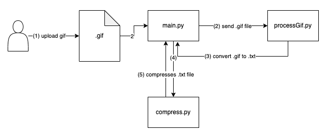

# LZW Data Compression and Decompression Algorithm

[](https://github.com/aishafarooque/LZW-GIF-Compression-Decompression)
[](https://www.python.org/downloads/release/python-360/)

This repository contains the code for the Lempel-Ziv-Welch Data Compression Algorithm. It has been modified to be applied on compression and decompression a .GIF file.

This code can also be found at https://github.com/aishafarooque/LZW-GIF-Compression-Decompression.


## Table of Contents
1. [Requirements and Libraries](#requirements)
2. [How to run](#howtorun)
3. [File Structure](#filestructure)
4. [Argument Parser Supported Parameters](#argparser)
5. [Expected Output](#expected)
6. [Program Flow](#flow)
7. [References](#references)

## Requirements and Libraries<a name="requirements"></a>
- Python3
- struct: https://docs.python.org/3/library/struct.html

## How to run:<a name="howtorun"></a>

To run this repository, enter the following into your terminal:
```console
aishafarooque@implementation~$ bash run.sh
```
The `run.sh` file will sanitize the working directory to remove any old outputs. It will make the `output/` and `results/` folder. And then, run a command to launch the `main.py` file.

The file can also be run using the following, but make sure to delete the output folder:
```console
aishafarooque@implementation~$ python3 main.py
```

### Argument Parser Supported Parameters:<a name="argparser"></a>
- `-i` - Path of the input gif, for example, `input/the-office.gif`

## File Structure<a name="filestructure"></a>

- The `input/` folder contains the .gif file to be processed. Only one file can be processed at a time.
- The `output/` folder contains intermediate files created during compression and decompression.
    - `encoded_gif.txt` is the .gif file as a string
    - `lzw-compressed.lzw` is the output after compressing.
    - `lzw-decompressed.txt` is the output after decompressing.
- The `report/` folder contains the pseudocode for the compression and decompression algorithms.
- `processGif.py` contains the code to convert the gif file to and from a string.

## Expected Output<a name="expected"></a>
For python3 main.py, the expected output is:
```
File encoded and saved to output/encoded_gif.txt
File decoded and saved to result/lzw-gif.gif
Size before compression: 67399
Size after compression: 67399
No data was lost after compression and decompression
```

## Program Flow<a name="flow"></a>
The flow for compression is:



The flow for decompression is:


## References<a name="references"></a>
All references for the code have been left above or below it. The LZW algorithm is based on the textbooks:
- Information And Entropy, Chapter 3.7.1 - LZW Example 1 and 2 (Paul Penfield, Jr.)
- Data Structures & Their Algorithms, Harper Collins Publishers, Harry R. Lewis and Larry Denenberg, 1991, and Data Structures and Algorithms, A. Drozdek, Brooks/Cole 2001.
- Cover, T. M., Thomas, J. A. (2006). Elements of Information Theory 2nd Edition (Wiley Series in Telecommunications and Signal Processing). Wiley-Interscience
